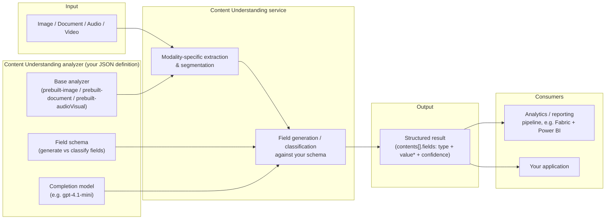

# Content Understanding architecture (high level)

This diagram explains how **Azure AI Content Understanding itself** works,
independent of either demo scenario in this repo (vehicle-claims intake,
marketing-campaign video analysis). For how *this repo* wires Content
Understanding into an app, see the "Azure architecture" diagram in
[`README.md`](../README.md); for the Fabric reporting pipeline, see
[`fabric/README.md`](../fabric/README.md).

## The core idea

Content Understanding takes unstructured input (an image, document, audio, or
video file) plus an **analyzer** you define, and returns **structured fields**
with per-field confidence — instead of a free-form model response you have to
parse yourself.

An analyzer is a small JSON definition (see `infra/analyzers/*.json`) with
three parts:

1. **`baseAnalyzerId`** — which built-in prebuilt analyzer to start from
   (`prebuilt-image`, `prebuilt-document`, `prebuilt-audioVisual`, ...). This
   selects the modality and the built-in extraction/segmentation behavior.
2. **`fieldSchema`** — the fields you want back, each with a `type`
   (`string`, `integer`, `number`, `array`, `object`, ...) and a `method`:
   - `generate` — a free-text/array value the model writes based on your
     field `description`.
   - `classify` — a value constrained to a fixed `enum`, for reliable
     aggregation (no string parsing needed downstream).
3. **`models`** — which completion model backs field generation/classification
   (e.g. `gpt-4.1-mini`).

## High-level pipeline

## How this repo's four analyzers fit the pattern

| Analyzer (`infra/analyzers/*.json`)         | Base analyzer         | Modality | Purpose |
| --------------------------------------------- | ---------------------- | -------- | ------- |
| `vehicle-image.json` (`flvVehicleAnalyzer`)   | `prebuilt-image`        | Image    | Extract vehicle type/make/model/VIN/damage from a first-look photo. |
| `vehicle-document.json` (`flvVehicleDocumentAnalyzer`) | `prebuilt-document` | Document | Extract title/registration fields from an uploaded vehicle document. |
| `commercial-video.json` (`flvCommercialVideoAnalyzer`, v1) | `prebuilt-video` | Video | Extract marketing attributes (brand, sentiment, CTA, humor) as mostly free text. |
| `commercial-video-v2.json` (`cuCommercialVideoAnalyzerV2`) | `prebuilt-video` | Video | Same marketing use case; evolves select v1 fields from free text to classified enums and adds quantitative fields. See `fabric/README.md`'s "Comparing analyzer schema versions" section. |

Two different analyzers over the same modality (video, here) is exactly the
mechanism this repo uses to demo **schema evolution**: the same input video
produces different structured output shapes depending only on which
analyzer's field schema you call it with — nothing about Content
Understanding itself changes between v1 and v2.

## Why field schema design matters

- `generate` fields are flexible and good for descriptive/narrative output,
  but require string parsing (and judgment calls) to aggregate or filter on
  later.
- `classify` fields with an `enum` are immediately `GROUP BY`/filter-ready in
  a reporting pipeline, at the cost of being less descriptive than free text.
- Most real analyzers land in between: a handful of fields worth classifying
  for reporting, alongside free-text fields for detail and quantitative
  fields (counts, scores) for trending — exactly the mix in
  `commercial-video-v2.json`.
